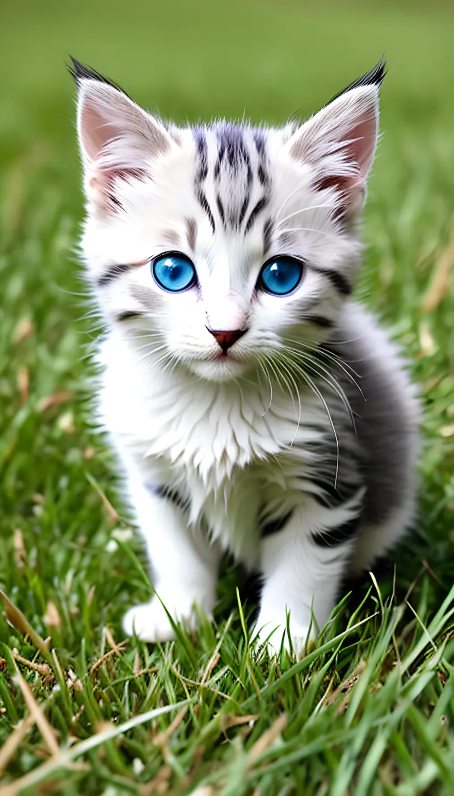

# 图片分类

> 基于 [openmmlab](https://platform.openmmlab.com/docs/zh-CN/open-api/introduction)



## 运行

python3 index.py

```json
[
  { "label": 285.0, "score": "0.6619948", "class": "Egyptian cat" },
  { "label": 281.0, "score": "0.1940860", "class": "tabby, tabby cat" },
  { "label": 282.0, "score": "0.0495534", "class": "tiger cat" },
  { "label": 287.0, "score": "0.0167874", "class": "lynx, catamount" },
  { "label": 232.0, "score": "0.0022601", "class": "Border collie" }
]
```
